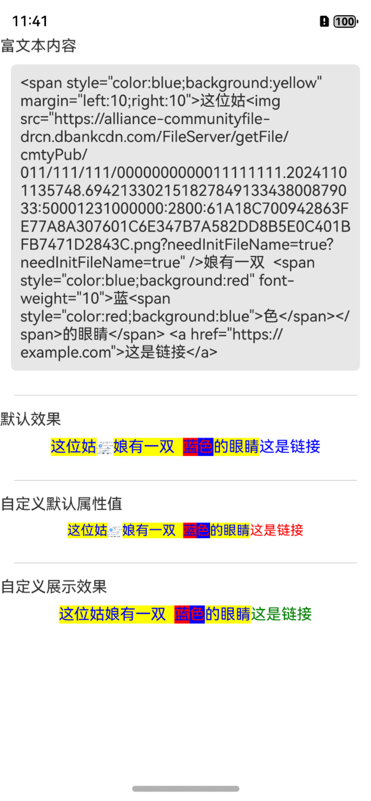

## 简介

简单的富文本展示组件：
支持的标签：span、font、br、a、img。
支持的属性：color、font-color、size、font-size、background、href。


已知问题：
当属性值中有`&`符号时(比如a标签的href属性)，解析会报 `Error: unterminated entity ref`这个错误，但不影响解析

### 效果图



## 安装

通过 ohpm

``` shell
ohpm install simplehtmlrender
```


## 示例

**注意**如果需要展示`img`标签，需要添加网络权限，可以参考这里[申请应用权限](https://developer.huawei.com/consumer/cn/doc/harmonyos-guides-V5/request-app-permissions-V5)

### 默认效果

```typescript
HtmlRender({htmlContent:this.htmlContent})
```

### 自定义默认属性

``` typescript
 HtmlRender({htmlContent:this.htmlContent,defaultStyle:{fontSize:14,hrefFontColor:Color.Red,fontColor:Color.Brown} as Style, onLinkClick:(link:string)=>{
        promptAction.showToast({message:`点击了链接 ${link}`})
      }})
```

### 自定义渲染

需要注意的是：`buildHtml`方法实际是在`HtmlRender`中执行，需要注意`this`指向

``` typescript
build() {
    HtmlRender({ htmlContent: this.htmlContent, builder: this.buildHtml }).margin(10)
}

@Builder
  buildHtml(vNode: VNode) {
    Text() {
      ForEach(vNode.child, (child: VNode) => {

        if (child.style.backgroundColor != Color.Transparent) {
          ContainerSpan() {
            if (child.style.href) {
              Span(child.text).configSpanStyle(child).onClick((_) => {
                promptAction.showToast({ message: child.style.href })
              }).fontColor(Color.Green)
            } else {
              Span(child.text).configSpanStyle(child).margin(20)
            }

          }.textBackgroundStyle({ color: child.style.backgroundColor })
        } else {
          if (child.style.href) {
            Span(child.text).configSpanStyle(child).onClick((_) => {
              promptAction.showToast({ message: child.style.href })
            }).fontColor(Color.Green).margin(20)
          } else {
            Span(child.text).configSpanStyle(child)
          }
        }
      })
    }
  }
@Extend(Span)
function configSpanStyle(vNode: VNode) {
  .backgroundColor(vNode.style.backgroundColor)
  .fontColor(vNode.style.href ? vNode.style.hrefFontColor : vNode.style.fontColor)
  .fontSize(vNode.style.fontSize)
}

```


## 限制

1. 目前只支持了上面说的那些标签级属性：span、font、br、a标签 和 color、font-color、size、font-size、background、href这些属性
2. 富文本的解析使用的是`xml.XmlPullParser`,因此对富文本内容中的标签要求比较严格，一定要严格闭合才行，否则解析会失败。
3. 为了解决某些元素没有包含在标签内的问题，在解析时在富文本最外层添加没有属性的span标签
4. 对于颜色值，只支持了有限了英文名字，建议使用`#xxxxxx`表示
5. 为了避免不必要的错误，富文本中只能出现默认支持和自定义支持的标签

## 结果展示

解析结果的展示是`Text`中嵌套`Span`和`ContainerSpan`实现的：
1. `Span`不支持背景色，要么只能依赖父级控件`Text`或者父级控件`ContainerSpan`来设置背景色
2. `ContainerSpan`只能包含`Span`、`ImageSpan`子组件。
3. `Span`、`ImageSpan` 没有子控件
4. ~~`ImageSpan`只支持本地资源，因此暂时没有处理图片相关标签~~ 
5. `ImageSpan`支持网络资源，但不支持`fitOriginalSize`属性，因此设置它的高度为字体大小，宽度按比例缩放;但`alt`属性只支持PixelMap，所以就暂时不支持了


也就是说解析结果只有一个`Text`控件，内容样式都由`Span`、`ImageSpan`和`ContainerSpan`完成

----

详细解释在这里 ：[鸿蒙-做一个简单的、大家都能学会的富文本解析渲染控件](https://juejin.cn/post/7427455855941156876)


